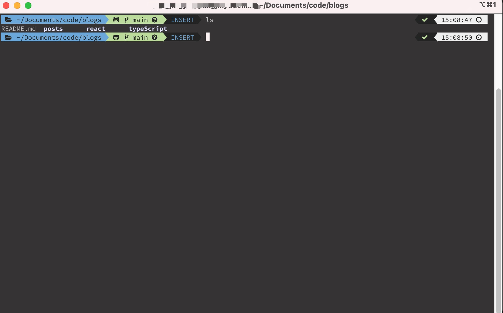
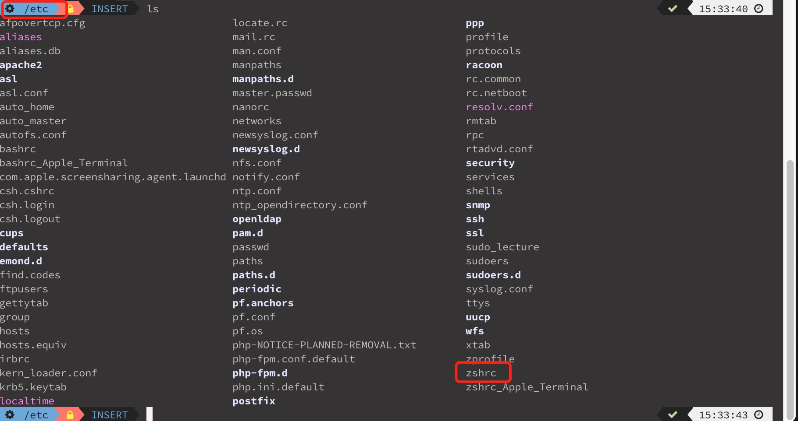
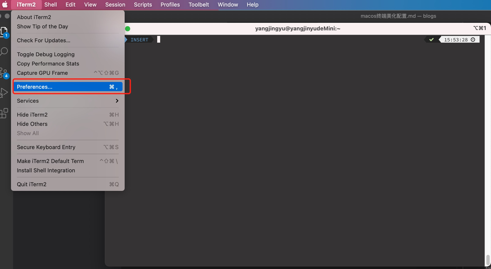
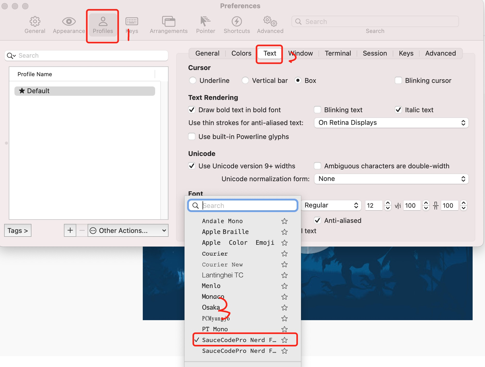
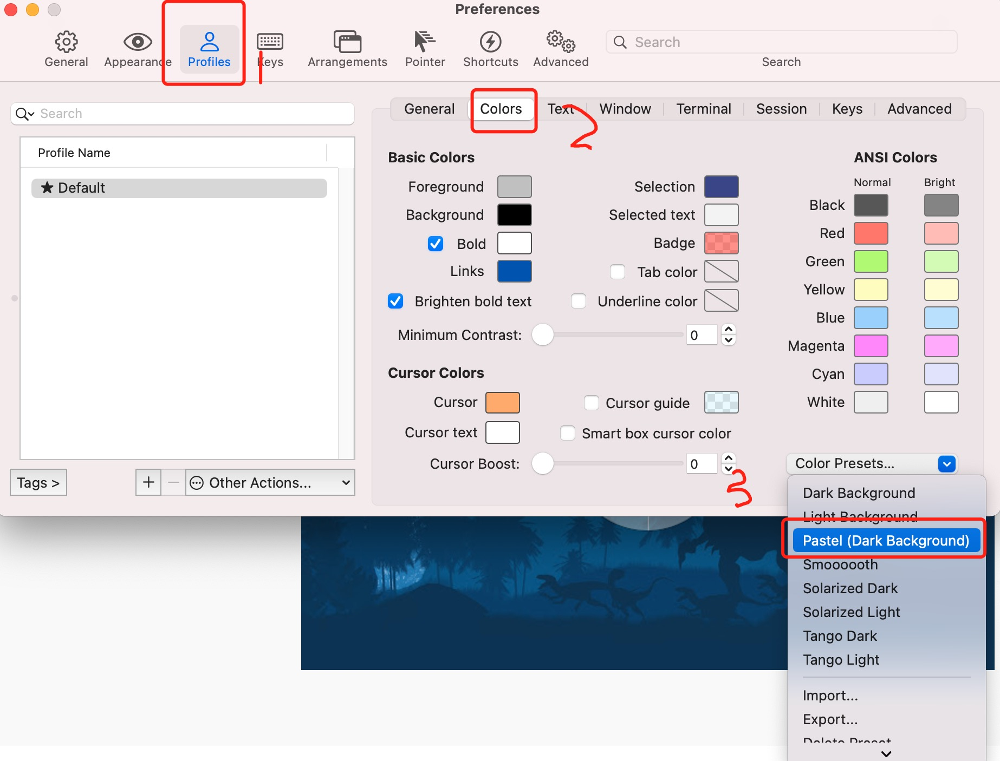

# macos 终端美化配置

美化后的效果如图



1. 安装`iTerm2` 访问[此链接](https://iterm2.com/)进行下载安装

2. 打开`iTerm2` 在其中输入以下命令，以安装`brew`

```shell
/bin/bash -c "$(curl -fsSL https://raw.githubusercontent.com/Homebrew/install/HEAD/install.sh)"
```

安装好后，按照提示进行简单的配置操作。如果上面的命令失效，访问[brew官网](https://brew.sh/)

安装git:

```shell
brew install git
```

3. 手动安装`oh-my-zsh`

**从git上把oh-my-zsh clone下来到根目录下**

```shell
git clone git://github.com/robbyrussell/oh-my-zsh.git ~/.oh-my-zsh
```

**再在根目录下copy一份.zshrc配置**

```shell
cp ~/.oh-my-zsh/templates/zshrc.zsh-template ~/.zshrc
```

4. 安装`powerlevel10k`使用码云的资源链接

```shell
git clone --depth=1 https://gitee.com/romkatv/powerlevel10k.git ${ZSH_CUSTOM:-$HOME/.oh-my-zsh/custom}/themes/powerlevel10k
```

5. 安装命令颜色高亮
```shell
brew install zsh-syntax-highlighting
```

6. 改写```.zshrc```配置

如下所示，在根目录下的etc文件夹下有一个zshrc文件，打开它复制如下的配置进行覆盖保存。



在终端输入

```shell
open .
```

就可以打开此目录。

将下面的配置粘贴进去进行覆盖保存。**记得修改其中的用户名**。

```shell
# If you come from bash you might have to change your $PATH.
# export PATH=$HOME/bin:/usr/local/bin:$PATH

# Path to your oh-my-zsh installation.
export ZSH="/Users/这里写你自己的mac用户名/.oh-my-zsh";
export PATH=/opt/local/bin:/opt/local/sbin:/Applications/xampp/xamppfiles/bin:$PATH

# Set name of the theme to load --- if set to "random", it will
# load a random theme each time oh-my-zsh is loaded, in which case,
# to know which specific one was loaded, run: echo $RANDOM_THEME
# See https://github.com/robbyrussell/oh-my-zsh/wiki/Themes

ZSH_THEME="powerlevel10k/powerlevel10k"
# POWERLEVEL9K_MODE="awesome-patched"

# command line 左邊想顯示的內容
POWERLEVEL9K_LEFT_PROMPT_ELEMENTS=(dir dir_writable vcs vi_mode)# <= left prompt 設了 "dir"
# command line 右邊想顯示的內容
POWERLEVEL9K_RIGHT_PROMPT_ELEMENTS=(status time) # <= right prompt 設了 "time"

POWERLEVEL9K_MODE='nerdfont-complete'


source /usr/local/share/zsh-syntax-highlighting/zsh-syntax-highlighting.zsh

# Set list of themes to pick from when loading at random
# Setting this variable when ZSH_THEME=random will cause zsh to load
# a theme from this variable instead of looking in ~/.oh-my-zsh/themes/
# If set to an empty array, this variable will have no effect.
# ZSH_THEME_RANDOM_CANDIDATES=( "robbyrussell" "agnoster" )

# Uncomment the following line to use case-sensitive completion.
# CASE_SENSITIVE="true"

# Uncomment the following line to use hyphen-insensitive completion.
# Case-sensitive completion must be off. _ and - will be interchangeable.
# HYPHEN_INSENSITIVE="true"

# Uncomment the following line to disable bi-weekly auto-update checks.
# DISABLE_AUTO_UPDATE="true"

# Uncomment the following line to change how often to auto-update (in days).
# export UPDATE_ZSH_DAYS=13

# Uncomment the following line to disable colors in ls.
# DISABLE_LS_COLORS="true"

# Uncomment the following line to disable auto-setting terminal title.
# DISABLE_AUTO_TITLE="true"

# Uncomment the following line to enable command auto-correction.
# ENABLE_CORRECTION="true"

# Uncomment the following line to display red dots whilst waiting for completion.
# COMPLETION_WAITING_DOTS="true"

# Uncomment the following line if you want to disable marking untracked files
# under VCS as dirty. This makes repository status check for large repositories
# much, much faster.
# DISABLE_UNTRACKED_FILES_DIRTY="true"

# Uncomment the following line if you want to change the command execution time
# stamp shown in the history command output.
# You can set one of the optional three formats:
# "mm/dd/yyyy"|"dd.mm.yyyy"|"yyyy-mm-dd"
# or set a custom format using the strftime function format specifications,
# see 'man strftime' for details.
# HIST_STAMPS="mm/dd/yyyy"

# Would you like to use another custom folder than $ZSH/custom?
# ZSH_CUSTOM=/path/to/new-custom-folder

# Which plugins would you like to load?
# Standard plugins can be found in ~/.oh-my-zsh/plugins/*
# Custom plugins may be added to ~/.oh-my-zsh/custom/plugins/
# Example format: plugins=(rails git textmate ruby lighthouse)
# Add wisely, as too many plugins slow down shell startup.
plugins=(git)

source $ZSH/oh-my-zsh.sh

# User configuration

# export MANPATH="/usr/local/man:$MANPATH"

# You may need to manually set your language environment
# export LANG=en_US.UTF-8

# Preferred editor for local and remote sessions
# if [[ -n $SSH_CONNECTION ]]; then
#   export EDITOR='vim'
# else
#   export EDITOR='mvim'
# fi

# Compilation flags
# export ARCHFLAGS="-arch x86_64"

# ssh
# export SSH_KEY_PATH="~/.ssh/rsa_id"

# Set personal aliases, overriding those provided by oh-my-zsh libs,
# plugins, and themes. Aliases can be placed here, though oh-my-zsh
# users are encouraged to define aliases within the ZSH_CUSTOM folder.
# For a full list of active aliases, run `alias`.
#
# Example aliases
# alias zshconfig="mate ~/.zshrc"
# alias ohmyzsh="mate ~/.oh-my-zsh"
```

7. 打开链接下载所需字体[字体文件](https://m.fontke.com/font/28278655/download/)
8. 安装使用字体

8.1 查询字体是否存在
```shell
brew search font
```
可以在`iTerm2`中使用 `command + f`快速查找


8.2 设置`tag`
```shell
brew tap homebrew/cask-fonts 
```

8.3 安装
```shell
brew install --cask font-sourcecodepro-nerd-font
```

9. 安装`zsh`
```shell
brew install zsh
```
设置`zsh`为默认
```shell
sudo sh -c "echo $(which zsh) >> /etc/shells" && chsh -s $(which zsh)
```

10. 设置主题颜色和字体

如下所示，打开`iTerm`进行操作


设置字体



设置颜色



最后将几个小模块的颜色，对应终端调整到对应的颜色即可。