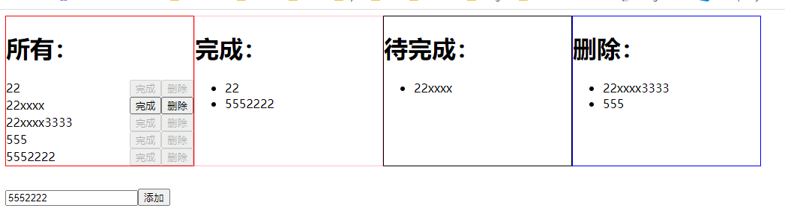

# 一、recoil 简单介绍

`recoil`是 Facebook 推出的 react 状态管理库。与其他状态管理库的不同之处在于，Recoil 使用简单，有类似于 vue 中的计算属性的特性，能够高性能的渲染。

# 二、recoil 核心 api

**非常重要的一点是：在 recoil 的 api 使用中，key 是必须的属性。并且 key 必须是全局唯一的。**原因如下：

> Atom 需要一个唯一的 key 值，该 key 可用于调试、持久化以及使用某些高级的 API，这些 API 可让你查看所有 atom 的图。两个 atom 不应拥有相同的 key 值，因此请确保它们在全局上的唯一性。

1. `atom`：`atom`是 recoil 核心 api，它相当于 react 中的 state。也就是状态。它的使用方法如下所示：

```ts
const atomState = atom({
  key: "atomState",
  default: 0,
});
```

2. `selector`:`selector`的功能类似于 vue 中的 computed 属性，它可以依托于一个 atom，然后派生出新的值。它的使用方法如下所示：

```ts
const selectorState = selector({
  key: "selectorState",
  get: ({ get }) => {
    const _val = get(atomState);
    return _val + 1;
  },
});
```

当`selector`没有指定 set 方法的时候，默认是只读的，没有办法对其进行赋值。 3. `Loadable`:`Loadable`对象代表 Recoil atom 或 selector 的当前状态。能够对这个对象返回的状态进行一些自己的处理，比如状态还在 loading 的时候就显示 loading 过渡等等。

```ts
function UserInfo({ userID }) {
  const userNameLoadable = useRecoilValueLoadable(userNameQuery(userID));
  setState;
  switch (userNameLoadable.state) {
    case "hasValue":
      return <div>{userNameLoadable.contents}</div>;
    case "loading":
      return <div>Loading...</div>;
    case "hasError":
      throw userNameLoadable.contents;
  }
}
```

4. `useRecoilState`:`useRecoilState`和 useState 的用法一致，可以对存储在 recoil 中的状态进行读写操作。

```ts
const [state, setState] = useRecoilState(state的名称);
```

5. `useRecoilValue`:当只需要读一个值，而不需要写的时候可以使用 useRecoilValue。

```ts
const names = useRecoilValue(namesState);
```

6. `useSetRecoilState`:返回一个 setter 函数，用来更新可写 Recoil state 的值。返回一个可以用来异步改变 state 的 setter 函数。可以传给此 setter 函数一个新的值，也可以传入一个更新函数，此函数接受上一次的值作为其参数。

```ts
const setNamesState = useSetRecoilState(namesState);
```

> 当一个组件需要写入而不需要读取 state 时，推荐使用此 hook。如果组件使用了 useRecoilState() 来获取 setter 函数，那么同时它也会订阅更新，并在 atom 或 selector 更新时重新渲染。使用 useSetRecoilState() 允许组件在值发生改变时而不用给组件订阅重新渲染的情况下设置值。

7. `useResetRecoilState`:返回一个函数，用来把给定 state 重置为其初始值。

```ts
const TodoResetButton = () => {
  const resetList = useResetRecoilState(todoListState);
  return <button onClick={resetList}>Reset</button>;
};
```

> 使用 useResetRecoilState() 可将组件的 state 重置为默认值，无需订阅组件，并且每当 state 改变时会重新渲染该组件。

8. `isRecoilValue`:如果 value 是一个 atom 或者 selector 则返回 true，反之，返回 false。

# 三、实现一个 todolist



1. 在项目根 inde.js 中加入如下代码

```js
ReactDOM.render(
  <RecoilRoot>
    <TodoListDemo />
  </RecoilRoot>,
  document.getElementById("root")
);
```

2. 核心代码如下所示

```js
import { useState } from "react";
import { atom, selector, useRecoilValue, useRecoilState } from "recoil";

// 所有信息列表
const ALL_LIST_STATE = atom({ key: "ALL_LIST_STATE", default: [] });

// 被删除的列表
const DEL_LIST_STATE = selector({
  key: "DEL_LIST_STATE",
  get: ({ get }) => {
    const allList = get(ALL_LIST_STATE);
    return allList.filter((item) => item.flag === "del");
  },
});

// 待办的列表
const ACTIVE_LIST_STATE = selector({
  key: "ACTIVE_LIST_STATE",
  get: ({ get }) => {
    const allList = get(ALL_LIST_STATE);
    return allList.filter((item) => item.flag === "active");
  },
});

// 完成的列表
const COMPLETE_LIST_STATE = selector({
  key: "COMPLETE_LIST_STATE",
  get: ({ get }) => {
    const allList = get(ALL_LIST_STATE);
    return allList.filter((item) => item.flag === "complete");
  },
});

// 完成的列表
const CompleteList = () => {
  const data = useRecoilValue(COMPLETE_LIST_STATE);
  return (
    <div style={{ border: "1px solid pink", width: "250px" }}>
      <h1>完成：</h1>
      <ul>
        {data.map((item) => (
          <li key={item.key}>{item.title}</li>
        ))}
      </ul>
    </div>
  );
};

// 激活列表
const AcitveList = () => {
  const data = useRecoilValue(ACTIVE_LIST_STATE);
  return (
    <div style={{ border: "1px solid black", width: "250px" }}>
      <h1>待完成：</h1>
      <ul>
        {data.map((item) => (
          <li key={item.key}>{item.title}</li>
        ))}
      </ul>
    </div>
  );
};

// 删除列表
const DelItemList = () => {
  const data = useRecoilValue(DEL_LIST_STATE);
  return (
    <div style={{ border: "1px solid blue", width: "250px" }}>
      <h1>删除：</h1>
      <ul>
        {data.map((item) => (
          <li key={item.key}>{item.title}</li>
        ))}
      </ul>
    </div>
  );
};

// 所有列表
const ALLItemList = () => {
  const [data, setData] = useRecoilState(ALL_LIST_STATE);

  const handleComplete = (key) => {
    const _data = data.map((item) => ({ ...item }));
    const obj = _data.find((item) => item.key === key);
    obj.flag = "complete";
    setData(_data);
  };

  const handleDel = (key) => {
    const _data = data.map((item) => ({ ...item }));
    const obj = _data.find((item) => item.key === key);
    obj.flag = "del";
    setData(_data);
  };

  const isDisabled = (flag) => flag === "complete" || flag === "del";

  return (
    <div style={{ border: "1px solid red", width: "250px" }}>
      <h1>所有：</h1>
      <div>
        {data.map((item) => (
          <div
            key={item.key}
            style={{ display: "flex", justifyContent: "space-between" }}
          >
            <div>{item.title}</div>
            <div>
              <button
                disabled={isDisabled(item.flag)}
                onClick={() => handleComplete(item.key)}
              >
                完成
              </button>
              <button
                disabled={isDisabled(item.flag)}
                onClick={() => handleDel(item.key)}
              >
                删除
              </button>
            </div>
          </div>
        ))}
      </div>
    </div>
  );
};

const TodoList = () => {
  const [list, setList] = useRecoilState(ALL_LIST_STATE);
  const [value, setValue] = useState("");

  const handleAdd = () => {
    if (!value) return;
    const _list = [...list];
    _list.push({ key: Date.now(), title: value, flag: "active" });
    setList(_list);
  };

  const onInputValueChange = (e) => setValue(e.target.value);

  return (
    <>
      <div style={{ display: "flex" }}>
        <ALLItemList />
        <CompleteList />
        <AcitveList />
        <DelItemList />
      </div>

      <div style={{ marginTop: "30px" }}>
        <input
          placeholder="请输入需要添加的待办事项"
          value={value}
          onChange={onInputValueChange}
        />
        <button onClick={handleAdd}>添加</button>
      </div>
    </>
  );
};

export default TodoList;
```

<!-- # 三、recoil、context 的对比 -->
